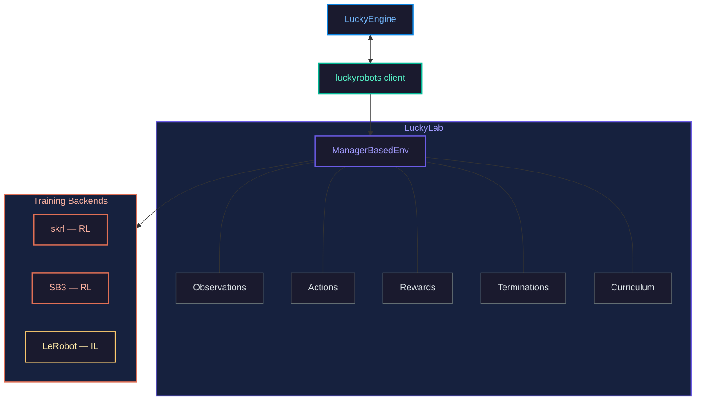

<p align="center">
  <h1 align="center">LuckyLab</h1>
  <p align="center">
    <strong>RL and IL training framework for <a href="https://github.com/luckyrobots/LuckyEngine">LuckyEngine</a></strong>
  </p>
  <p align="center">
    <a href="https://luckyrobots.com"></a>
    <a href="https://github.com/luckyrobots/LuckyEngine"></a>
    <a href="LICENSE"></a>
  </p>
  <p align="center">
    <a href="https://www.python.org/downloads/"></a>
    <a href="https://pytorch.org/">= 2.0"></a>
    <a href="https://github.com/luckyrobots/luckyrobots">= 0.1.84"></a>
    <a href="https://docs.astral.sh/ruff/"></a>
  </p>
</p>

LuckyLab is the training and inference layer for robots simulated in [LuckyEngine](https://github.com/luckyrobots/LuckyEngine). It connects to LuckyEngine over gRPC (via the [luckyrobots](https://github.com/luckyrobots/luckyrobots) client), sends joint-level actions, and receives observations each step — all physics and rendering runs in LuckyEngine.

---
## Quick Start
### 1. Installation

```bash
git clone -b mick/release-2026-1 --single-branch https://github.com/luckyrobots/luckylab.git
cd luckylab

# Run the setup script for your OS 
./setup.bat # Windows 
./setup.sh # Linux
```
### 2. Prepare LuckyEngine

1. Launch LuckyEngine
2. Download the Piper Block Stacking project
3. Open the Piper Block Stacking scene
4. Open the gRPC Panel
<table><tr><td>

5. Follow the prompts to ensure:
   - Action Gate is **Enabled**
   - Server is **Running**
   - Scene is **Playing**

</td><td>


</td></tr></table>

### 3. Run Debug Viewer

```bash
# Run the gRPC viewer script for your OS 
./run_debug_viewer.bat # Windows 
./run_debug_viewer.sh # Linux
```

If everything has been configured correctly, this script will log the inputs/outputs between LuckyLab and LuckyEngine, and display the camera feed being exported from LuckyEngine to LuckyLab.
### 4. Download & Run Piper Block Stacking Demo Model

```bash
# Run the model download script for your OS
# Windows 
./download_demo.bat 
./run_demo.bat

# Linux
./download_demo.sh
./run_demo.sh
```

Manually downloaded models need to be placed within their own subfolder within the /runs/ directory of LuckyLab, where-as the download scripts already extract to the appropriate nested location.

---

## How It Works



LuckyEngine handles all physics simulation (built on MuJoCo). LuckyLab is purely a training orchestrator — it does not run physics locally. The [luckyrobots](https://github.com/luckyrobots/luckyrobots) package manages the gRPC connection, engine lifecycle, and domain randomization protocol.

---

## Status

LuckyLab is in **early development (alpha)**. The Piper block-stacking demo above is the current focus. The codebase also includes scaffolding for reinforcement learning (Go2 velocity tracking via [skrl](https://github.com/Toni-SM/skrl) / [Stable Baselines3](https://github.com/DLR-RM/stable-baselines3)) and additional imitation learning policies via [LeRobot](https://github.com/huggingface/lerobot).

---

## Development

```bash
# Manual install with uv (instead of setup scripts)
uv sync --all-groups
uv run pre-commit install

# Tests
uv run pytest tests -v

# Lint
uv run ruff check src tests
uv run ruff format src tests
```
