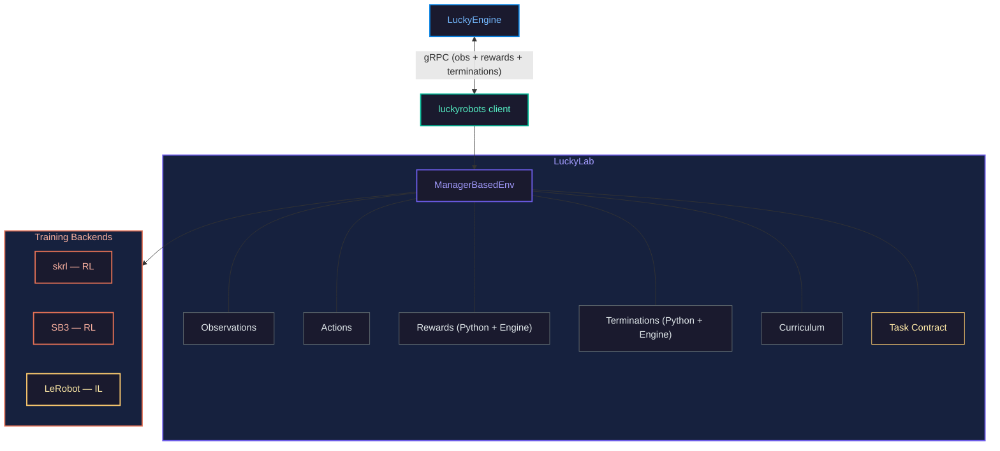

<p align="center">
  <h1 align="center">LuckyLab</h1>
  <p align="center">
    <strong>A unified robot learning framework powered by <a href="https://github.com/luckyrobots/LuckyEngine">LuckyEngine</a></strong>
  </p>
  <p align="center">
    <a href="https://luckyrobots.com"></a>
    <a href="https://github.com/luckyrobots/LuckyEngine"></a>
    <a href="LICENSE"></a>
  </p>
  <p align="center">
    <a href="https://www.python.org/downloads/"></a>
    <a href="https://pytorch.org/">= 2.0"></a>
    <a href="https://github.com/luckyrobots/luckyrobots">= 0.2.0"></a>
    <a href="https://docs.astral.sh/ruff/"></a>
  </p>
</p>

LuckyLab handles RL training, IL training, and policy inference for robots simulated in [LuckyEngine](https://luckyrobots.com). It communicates with the engine over gRPC (port 50051) via [luckyrobots](https://github.com/luckyrobots/luckyrobots).

**Note:** For simple RL training, you may not need LuckyLab at all — [luckyrobots](https://github.com/luckyrobots/luckyrobots) v0.2.0 provides `LuckyEnv`, a standalone Gymnasium wrapper that lets you train in ~20 lines. LuckyLab is for users who want the full framework: manager-based MDP decomposition, observation noise pipelines, curriculum scheduling, NaN guards, multi-backend training (skrl, SB3, LeRobot), and the task contract system for engine-side reward computation.

| Robot | Task | Learning |
|-------|------|----------|
| Unitree Go2 | Velocity tracking | RL (PPO, SAC) |
| SO-100 | Pick-and-place | IL (ACT via LeRobot) |
| Piper | Block stacking | IL (ACT via LeRobot) |

---

## Setup

### 1. Install LuckyLab

```bash
git clone https://github.com/luckyrobots/luckylab.git
cd luckylab

# Run the setup script for your OS
./scripts/setup.sh   # Linux / macOS
./scripts/setup.bat  # Windows
```

Or install manually with [uv](https://docs.astral.sh/uv/):

```bash
# RL only
uv sync --group rl

# IL only (LeRobot)
uv sync --group il

# Everything (RL + IL + Rerun + dev tools)
uv sync --all-groups
```

### 2. Start LuckyEngine

LuckyLab does not launch the engine — you need to start it yourself first.

1. Open LuckyEngine
2. Load a scene (e.g. the Go2 velocity scene or SO-100 pick-and-place scene)
3. Open the **gRPC Panel**
<table><tr><td>

4. Follow the prompts to ensure:
   - Action Gate is **Enabled**
   - Server is **Running**
   - Scene is **Playing**

</td><td>


</td></tr></table>

---

## Quick Start — Piper Block Stacking Demo

Download and run the pre-trained Piper block stacking demo:

```bash
# Download the demo model
./scripts/download_demo.sh   # Linux / macOS
./scripts/download_demo.bat  # Windows

# Run the demo (extracted from demo zip into repo root)
./run_demo.sh   # Linux / macOS
./run_demo.bat  # Windows
```

### Debug Viewer

Verify your gRPC connection with the debug viewer:

```bash
./scripts/run_debug_viewer.sh   # Linux / macOS
./scripts/run_debug_viewer.bat  # Windows
```

---

## Training

### RL — Go2 velocity tracking

```bash
# Using the convenience script
./scripts/train_rl.sh   # Linux / macOS
./scripts/train_rl.bat  # Windows

# Or run directly with custom options
uv run python -m luckylab.scripts.train go2_velocity_flat \
    --agent.algorithm sac --agent.backend skrl --device cuda
```

The convenience script defaults to SAC / skrl / cuda. Override any option by passing extra args:

```bash
./scripts/train_rl.sh --agent.algorithm ppo
./scripts/train_rl.sh --device cpu
```

Checkpoints are saved to `runs/go2_velocity_sac/checkpoints/` every 5,000 steps.

The Go2 velocity task now includes a **TaskContract** that enables engine-side reward computation. When the engine supports it, reward signals like `track_linear_velocity`, `feet_air_time`, and `orientation_error` are computed directly from MuJoCo state and merged with Python-computed rewards automatically.

### IL — SO-100 pick-and-place

```bash
# Using the convenience script
./scripts/train_il.sh   # Linux / macOS
./scripts/train_il.bat  # Windows

# Or run directly
uv run python -m luckylab.scripts.train so100_pickandplace \
    --il.policy act \
    --il.dataset-repo-id luckyrobots/so100_pickandplace_sim \
    --device cuda
```

Datasets are loaded from the [HuggingFace Hub](https://huggingface.co/datasets) or from a local directory at `~/.luckyrobots/data/`.

---

## Inference

### RL

```bash
# Using the convenience script (first arg = checkpoint path)
./scripts/play_rl.sh runs/go2_velocity_sac/checkpoints/agent_25000.pt
./scripts/play_rl.sh runs/go2_velocity_sac/checkpoints/agent_25000.pt --keyboard

# Windows
scripts\play_rl.bat runs\go2_velocity_sac\checkpoints\agent_25000.pt
```

Keyboard controls: **W/S** forward/back, **A/D** strafe, **Q/E** turn, **Space** zero, **Esc** quit.

### IL

```bash
# Using the convenience script (first arg = checkpoint path)
./scripts/play_il.sh runs/so100_pickandplace_act/final
./scripts/play_il.sh runs/so100_pickandplace_act/final --episodes 20

# Windows
scripts\play_il.bat runs\so100_pickandplace_act\final
```

---

## Task Contract System

LuckyLab supports **task contracts** — declarative specifications that tell the engine which reward signals and termination conditions to compute alongside observations. This moves expensive MDP computation (contact forces, foot slip, joint acceleration) to the C++ engine, reducing Python overhead.

### Discover engine capabilities

```bash
# List all available MDP components from a running engine
python -m luckylab.scripts.list_capabilities --robot unitreego2

# Validate a task's contract against engine capabilities
python -m luckylab.scripts.validate_task go2_velocity_flat

# Compare manifests across engine versions
python -m luckylab.scripts.diff_capabilities --save baseline.json
# ... engine update ...
python -m luckylab.scripts.diff_capabilities --old baseline.json --live
```

### Available engine MDP components

**Observations:** `base_lin_vel`, `base_ang_vel`, `projected_gravity`, `joint_pos`, `joint_vel`, `vel_command`, `foot_contact`, `foot_heights`, `foot_contact_forces`, `actions`

**Reward signals:** `track_linear_velocity`, `track_angular_velocity`, `lin_vel_z_penalty`, `ang_vel_xy_penalty`, `joint_acc_penalty`, `feet_air_time`, `orientation_error`, `action_rate`, `action_magnitude`, `foot_slip_penalty`, `stand_still`

**Termination conditions:** `fell_over`, `time_out`, `illegal_contact`

**Domain randomization:** `friction`, `mass_scale`, `motor_strength`, `motor_offset`, `push_disturbance`, `joint_position_noise`, `joint_velocity_noise`, `pose_position_noise`, `pose_orientation_noise`

### Define a task contract

```python
from luckylab.contracts import (
    TaskContract, ObservationContract, ObservationTermRequest,
    RewardContract, RewardTermRequest,
    TerminationContract, TerminationTermRequest,
)

contract = TaskContract(
    task_id="go2_velocity_flat",
    robot="unitreego2",
    scene="velocity",
    observations=ObservationContract(
        required=[
            ObservationTermRequest("base_lin_vel"),
            ObservationTermRequest("base_ang_vel"),
            ObservationTermRequest("projected_gravity"),
            ObservationTermRequest("joint_pos"),
            ObservationTermRequest("joint_vel"),
            ObservationTermRequest("vel_command"),
        ],
    ),
    rewards=RewardContract(
        engine_terms=[
            RewardTermRequest("track_linear_velocity", weight=2.0),
            RewardTermRequest("feet_air_time", weight=0.2),
            RewardTermRequest("orientation_error", weight=-1.0),
        ],
        python_terms=["foot_clearance"],  # Computed in Python
    ),
    terminations=TerminationContract(
        terms=[
            TerminationTermRequest("fell_over"),
            TerminationTermRequest("time_out", is_timeout=True),
        ],
    ),
)
```

Set `task_contract` on `ManagerBasedRlEnvCfg` and the engine will compute those signals each step, merged automatically with Python-computed rewards.

---

## Available Tasks

```bash
./scripts/list_tasks.sh   # Linux / macOS
./scripts/list_tasks.bat  # Windows
```

| Task ID | Robot | Type | Algorithms | Task Contract |
|---------|-------|------|------------|:-------------:|
| `go2_velocity_flat` | Unitree Go2 | RL | PPO, SAC | Yes |
| `so100_pickandplace` | SO-100 | IL | ACT | No |

Any algorithm supported by [skrl](https://github.com/Toni-SM/skrl) or [Stable Baselines3](https://github.com/DLR-RM/stable-baselines3) can be used for RL, and any policy supported by [LeRobot](https://github.com/huggingface/lerobot) can be used for IL — you just need to define the configs for them.

---

## Visualization

**Rerun** — live inspection of observations, actions, rewards, and camera feeds:

```bash
# Browse a dataset (opens web viewer)
./scripts/visualize_dataset.sh   # Linux / macOS
./scripts/visualize_dataset.bat  # Windows

# Or run directly with custom options
uv run python -m luckylab.scripts.visualize_dataset \
    --repo-id luckyrobots/so100_pickandplace_sim --episode-index 0 --web

# Attach Rerun to an evaluation run
./scripts/play_rl.sh runs/go2_velocity_sac/checkpoints/agent_25000.pt --rerun
```

**Weights & Biases** — enabled by default for RL training. Disable with `--agent.wandb false`.

---

## Convenience Scripts

All scripts live in the `scripts/` folder and are available as both `.sh` (Linux/macOS) and `.bat` (Windows).

| Script | Description |
|--------|-------------|
| `scripts/setup` | Install dependencies and pre-commit hooks |
| `scripts/download_demo` | Download pre-trained Piper block stacking demo model |
| `scripts/run_debug_viewer` | gRPC debug viewer with camera feed |
| `scripts/run_multicam_test` | Multi-camera gRPC stress test |
| `scripts/list_tasks` | List all registered tasks |
| `scripts/train_rl` | Train RL policy (Go2 velocity — SAC/skrl/cuda) |
| `scripts/train_il` | Train IL policy (SO-100 pick-and-place — ACT/cuda) |
| `scripts/play_rl` | Run trained RL policy (requires checkpoint arg) |
| `scripts/play_il` | Run trained IL policy (requires checkpoint arg) |
| `scripts/visualize_dataset` | Browse SO-100 dataset in Rerun web viewer |

### Task Contract CLI Tools

| Command | Description |
|---------|-------------|
| `python -m luckylab.scripts.list_capabilities` | List available engine MDP components |
| `python -m luckylab.scripts.validate_task <task_id>` | Validate a task contract against engine |
| `python -m luckylab.scripts.diff_capabilities` | Compare manifests across engine versions |

---

## How It Works



LuckyEngine handles all physics simulation (built on MuJoCo). LuckyLab is a training orchestrator — it does not run physics locally. The [luckyrobots](https://github.com/luckyrobots/luckyrobots) package (v0.2.0+) manages the gRPC connection, engine lifecycle, and domain randomization protocol. When a task contract is active, the engine computes reward signals and termination flags engine-side, and LuckyLab merges them with Python-computed values automatically.

---

## Development

```bash
uv sync --all-groups
uv run pre-commit install

uv run pytest tests -v
uv run ruff check src tests
uv run ruff format src tests
```

---

## License

MIT License — see [LICENSE](LICENSE) for details.
